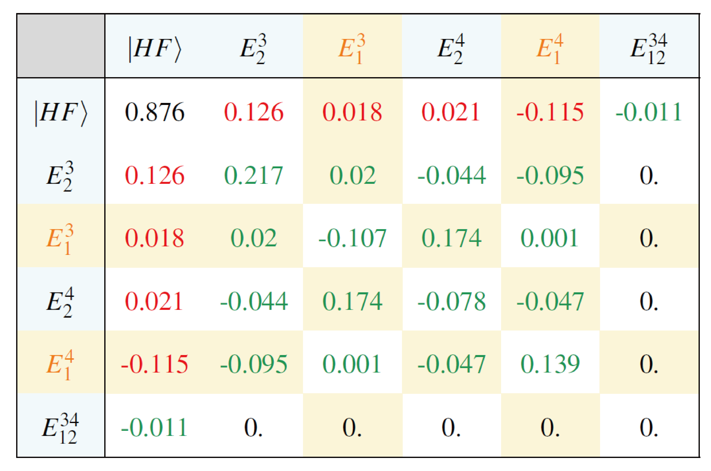

Molecular CISD
**************
.. sectionauthor:: Chong Sun

CISD Coefficients and amplitudes
================================

Nomenclature:
-------------

-  Strings: the state decided by occupations, e.g.,
   :math:`|001101\rangle`.

-  States: the state decided by applying excitation operators onto
   :math:`|\Phi_0\rangle = |HF\rangle`, e.g.,
   :math:`a^\dagger_4 a_2 |\Phi_0\rangle`.

-  Coefficients: linear combination coefficient of strings.

-  Amplitudes: linear combination coefficients of states.

Note that
:math:`a^\dagger_4 a_2 |\Phi_0\rangle = a^\dagger_4 a_2 a^\dagger_3 a^\dagger_2 a^\dagger_1 |-\rangle = - a^\dagger_4 a^\dagger_3 a^\dagger_1 |-\rangle = -|001101\rangle`.
Therefore, one has to be careful with the sign changes going from states
to strings or backward.

Representing a CISD wavefunction
--------------------------------

In PySCF, there are three ways of representing a CISD wavefunction: (1)
CISD coefficients, (2) FCI coefficients, and (3) CISD amplitudes.

CISD coefficients
~~~~~~~~~~~~~~~~~

The CISD coefficients :math:`\mathbf{v}` are linear combination
coefficients of the CISD *strings*,

.. math::

   \begin{split}
   |\Psi\rangle = \sum_i v_i |s_i\rangle,
   \end{split}

where :math:`|s_i\rangle` is a Slater determinant of a certain
occupation pattern, e.g. :math:`|001011\rangle`.

The CISD coefficients :math:`\mathbf{v}` are obtained by calling
``cisd.kernel()``.::

    myci = ci.UCISD(mf) # define myci object from mf
    e_corr, cisdvec = myci.kernel() # perform CISD calculation

``cisdvec`` is a 1D ``numpy`` array, corresponding to the *coefficients*
of *strings*, the order of elements in the civec is

.. math::

   \begin{split}
   [v_0, v_{1\uparrow}, v_{1\downarrow}, v_{2 \uparrow\downarrow}, v_{2\uparrow\uparrow}, v_{2\downarrow\downarrow}],
   \end{split}

where :math:`v_0` is of length 1, :math:`v_{1\uparrow}` and
:math:`v_{1\downarrow}` are of length :math:`N_\text{occ}N_\text{vir}`
(suppose the two spins have the same number of electrons),
:math:`v_{2 \uparrow\downarrow}` is of size
:math:`(N_\text{occ}N_\text{vir})^2`, :math:`v_{2\uparrow\uparrow}` and
:math:`v_{2\downarrow\downarrow}` are of size
:math:`{N_\text{occ}\choose 2}{N_\text{vir}\choose 2}`. The orbital
order of :math:`v_2` is the asscending order of :math:`o_1o_2v_1v_2`,
where :math:`o_2 > o_1` and :math:`v_2 > v_1`.

FCI coefficients
~~~~~~~~~~~~~~~~

One can turn the CISD coefficients into the FCI coefficients by calling::

    fcivec = myci.to_fcivec(cisdvec)

which can be used as, e.g., an initial guess of the FCI calculation.

The reverse operation is::

    cisdvec = myci.from_fcivec(fcivec)

CISD amplitudes
~~~~~~~~~~~~~~~

The amplitudes :math:`\mathbf{c}` are coefficients of

.. math::

   \begin{split}\label{eq:sum_amplitude}
   |\Psi\rangle = \sum_i c_i \hat{E}_i |\Phi_0\rangle,
   \end{split}

where :math:`|\Phi_0\rangle` is the Slater determinant for the ground
state, and :math:`\hat{E}_i` is an excitation operator of any order,
e.g.,
:math:`\hat{E}_i = \hat{a}^\dagger_p \hat{a}_q \hat{a}^\dagger_r \hat{a}_s`.
However, there is *double counting* in the sum of
Eq. \ `[eq:sum_amplitude] <#eq:sum_amplitude>`__, since
:math:`\hat{a}^\dagger_p \hat{a}_q \hat{a}^\dagger_r \hat{a}_s` and
:math:`\hat{a}^\dagger_r \hat{a}_s\hat{a}^\dagger_p \hat{a}_q` correspond to
the same CI string.

In the following, we first give the PySCF syntax of deriving the
amplitude, then evaluate the double counting in each type of excitation.

The CISD amplitudes can be derived by::

    c0, c1, c2 = myci.cisdvec_to_amplitudes(cisdvec)

where ``c0`` is the coefficient of
the HF GS; ``c1`` is a list of arrays of spin-up and spin-down
amplitudes, respectively; ``c2`` is a list of arrays of
:math:`\uparrow\uparrow`, :math:`\uparrow\downarrow` and
:math:`\downarrow\downarrow` excitations, respectively.

The reverse operation is::

    cisdvec = myci.amplitudes_to_cisdvec(c0, c1, c2)

| **Single excitation**
| The array for each spin is of size
  :math:`(N_\text{occ}, N_\text{vir})`, which means that the
  :math:`(i, a)`\ th element corresponds to the amplitude of
  :math:`\hat{E}_i^a|\Phi_0\rangle`. There is no double counting for
  single excitations.

| **Double excitation**
| Each array is of dimension
  :math:`(N_\text{occ}, N_\text{occ}, N_\text{vir}, N_\text{vir})`. The
  1st and 3rd arrays are amplitudes for same-spin excitations. The 2nd
  array corresponds to single excitations from each spin, and is of
  dimension
  :math:`(N^\uparrow_\text{occ}, N^\downarrow_\text{occ}, N^\uparrow_\text{vir}, N^\downarrow_\text{vir})`.

For the same spin double excitations, since

.. math::

   \begin{split}
   \hat{a}^\dagger_p \hat{a}_q \hat{a}^\dagger_r \hat{a}_s
   =  \hat{a}^\dagger_r \hat{a}_s \hat{a}^\dagger_p \hat{a}_q
   = -\hat{a}^\dagger_p \hat{a}_s \hat{a}^\dagger_r \hat{a}_q
   = -\hat{a}^\dagger_r \hat{a}_q \hat{a}^\dagger_p \hat{a}_s,
   \end{split}

there is :math:`4` fold degeneracy.

For cross-spin excitation, there is no double counting.

| **Example:**
| H\ :math:`_4` chain at :math:`R=1.5`\ Å with STO-3G, 4 orbitals, 4
  electrons, UCISD.

We first write the CISD vector in the FCI vector form (use
``myci.to_fcivec(civec, norb, nelec)`` ), The order of FCI strings is:

====== ===================
string  state
====== ===================
0011   :math:`|HF\rangle`
1001   :math:`E_2^4`
0101   :math:`E_2^3`
1010   -:math:`E_1^4`
0110   -:math:`E_1^3`
1100   :math:`E_{12}^{34}`
====== ===================

In the following table, we present the coefficients for CI strings. We
use the excitations to represent the strings for clarity, and keep in
mind that the coefficients are with respect to strings not states. The
corresponding FCI vector is

The rows are excitations for spin-up, and columns for spin-down. The red
numbers corresponds to single excitations, and the green numbers are
double excitations. Orange color corresponds to a minus sign.

The CISD amplitudes, i.e., the coefficient of the states, are derived by
calling::

    c0, c1, c2 = myci.cisdvec_to_amplitudes(civec)

Next, we examine the amplitudes ``c1`` from single excitations. ``c1`` is a 3D
array of size :math:`(2, 2, 2)`, stands for (spin, occ, vir), and the
values are

.. math::

   \begin{split}
   C_1^{\uparrow} = \begin{pmatrix}
    -0.018 & 0.115\\
     0.126 & 0.021
   \end{pmatrix}, \quad
   C_1^{\downarrow} = \begin{pmatrix}
    -0.018 & 0.115\\
     0.126 & 0.021
   \end{pmatrix}
   \end{split}

Therefore, the amplitedes corresponding to :math:`C_1` is

.. math::

   \begin{split}
   C_{1, ia} \rightarrow \hat{E}_i^a |\Phi_0\rangle.
   \end{split}

Next we examine double excitation amplitudes ``c2``. The array
corresponding to ``c2`` is of size (spin, nocc, nocc, nvir, nvir), where
the spin corresponds to
:math:`o^\alpha_1 o^\alpha_2 v^\alpha_1 v^\alpha_2`,
:math:`o^\alpha_1 o^\beta_2 v^\alpha_1 v^\beta_2`,
:math:`o^\beta_1 o^\beta_2 v^\beta_1 v^\beta_2`, where
:math:`\alpha = \uparrow`, :math:`\beta = \downarrow`, :math:`1` and
:math:`2` denotes two excitation pairs.

.. math::

   \begin{split}
   C_2^{\uparrow\uparrow}[0,1,0,1] (E_{12}^{34}) = -0.11, &\quad 
   C_2^{\uparrow\uparrow}[0,1,1,0] (E_{12}^{43}) = 0.11 \\
   C_2^{\uparrow\uparrow}[1,0,0,1] (E_{21}^{34}) = 0.11, &\quad 
   C_2^{\uparrow\uparrow}[1,0,1,0] (E_{21}^{43}) = -0.11 
   \end{split}

.. math::

   \begin{split}
   C_2^{\uparrow\downarrow}[0,0,0,0] (\hat{E}_1^3\hat{E}_1^3) = -0.107, &\quad 
   C_2^{\uparrow\downarrow}[0,0,0,1] (\hat{E}_1^3\hat{E}_1^4) = 0.001, \\
   C_2^{\uparrow\downarrow}[0,0,1,0] (\hat{E}_1^4\hat{E}_1^3) = 0.001, &\quad 
   C_2^{\uparrow\downarrow}[0,0,1,1] (\hat{E}_1^4\hat{E}_1^4) = 0.139, \\
   C_2^{\uparrow\downarrow}[0,1,0,0] (\hat{E}_1^3\hat{E}_2^3) = -0.02, &\quad 
   C_2^{\uparrow\downarrow}[0,1,0,1] (\hat{E}_1^3\hat{E}_2^4) = -0.174, \\
   &\cdots\\
   \end{split}

.. math::

   \begin{split}
   C_2^{\downarrow\downarrow} = C_2^{\uparrow\uparrow}
   \end{split}

Therefore

.. math::

   \begin{split}
   C_2[i, j, a, b] \rightarrow \hat{E}_{ij}^{ab} = a^\dagger_a a_i a^\dagger_b a_j  
   \end{split}

