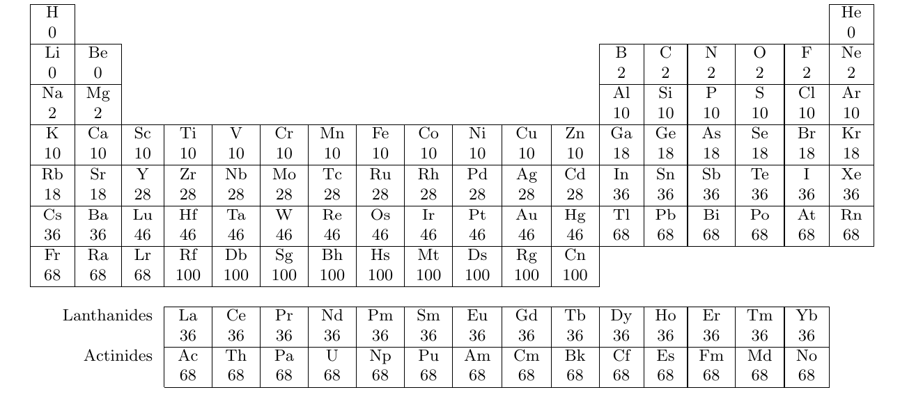

.. _user_mp2:

Second-order Møller–Plesset perturbation theory (MP2)
*****************************************************

*Modules*: :py:mod:`pyscf.mp`, :py:mod:`pyscf.pbc.mp`

The MP2 and coupled-cluster functionalities of PySCF are similar.  See
also :ref:`user_cc`.

Introduction
============

Second-order Møller--Plesset perturbation theory (MP2) :cite:`Moller1934` is a
post-Hartree--Fock method. MP2 calculations can be performed in PySCF with or without
density fitting, depending on the initial SCF calculation.

Note also the existence of a :ref:`native DF-MP2 implementation<DFMP2>`, which does
not depend on the integral approximation in SCF, and which is significantly faster than the
default implementation of MP2 with density fitting.

A simple example (see :source:`examples/mp/00-simple_mp2.py`) of running
an MP2 calculation is

.. literalinclude:: ../../examples/mp/00-simple_mp2.py

which outputs

.. code::

  converged SCF energy = -99.9873974403487
  E(MP2) = -100.198764900659  E_corr = -0.211367460310054

namely, the Hartree--Fock energy, the MP2 energy and their difference, the
MP2 correlation energy.

.. note::

  The last line in the code example above could have been replaced by

  .. code ::
    
    pyscf.mp.MP2(mf).kernel()

  or

  .. code ::
    
    pyscf.mp.MP2(mf).run()
  
  for the same result.

Spin symmetry
=============

The MP2 module in PySCF supports a number of reference wavefunctions with
broken spin symmetry.  In particular, MP2 can be performed with a
spin-restricted, spin-unrestricted, and general (spin-mixed) Hartree-Fock
solution, leading to the RMP2, UMP2, and GMP2 methods.

The module-level ``mp.MP2(mf)`` constructor can infer the correct method based
on the level of symmetry-breaking in the mean-field argument.  For more explicit
control or inspection, the respective classes and functions can be found in
``mp2.py`` (restricted), ``ump2.py`` (unrestricted), and ``gmp2.py``
(general).

For example, a spin-unrestricted calculation on triplet oxygen can be performed
as follows::

    from pyscf import gto, scf, mp
    mol = gto.M(
        atom = 'O 0 0 0; O 0 0 1.2',  # in Angstrom
        basis = 'ccpvdz',
        spin = 2
    )
    mf = scf.HF(mol).run() # this is UHF
    mymp = mp.MP2(mf).run() # this is UMP2
    print('UMP2 total energy = ', mymp.e_tot)

Properties
==========

A number of properties are available at the MP2 level.

Unrelaxed 1- and 2-electron reduced density matrices can be calculated. 
They are returned in the MO basis::

    dm1 = mymp.make_rdm1()
    dm2 = mymp.make_rdm2()

Analytical nuclear gradients can be calculated :cite:`Pople1979,Handy1985,Yamaguchi2011m` ::

    mygrad = mymp.nuc_grad_method().run()

.. _user_mp2_frozen:

Frozen orbitals
===============

By default, MP2 calculations in PySCF correlate all electrons in all available
orbitals. To freeze the lowest-energy core orbitals, use
the ``frozen`` keyword argument::

    mymp = mp.MP2(mf, frozen=2).run()

To freeze occupied and/or unoccupied orbitals with finer control, a
list of 0-based orbital indices can be provided as the ``frozen``
keyword argument::
    
    # freeze 2 core orbitals
    mymp = mp.MP2(mf, frozen=[0,1]).run()
    # freeze 2 core orbitals and 3 unoccupied orbitals
    mymp = mp.MP2(mf, frozen=[0,1,16,17,18]).run()

The number of core orbitals to be frozen can be generated automatically::
    
    mymp = mp.MP2(mf).set_frozen().run()

``set_frozen()`` will freeze the core orbitals determined by sum of the core electrons of atoms, which are shown as follows. 
The current rule is the same as that of ORCA program.

Job control
===========

Avoid t2 storage
----------------
If the t2 amplitudes are not required after the MP2 calculation, they
don't need to be saved in memory::

    mymp = mp.MP2(mf)
    # by default, with_t2=True 
    mymp.kernel(with_t2=False)

.. _DFMP2:

Density-fitted MP2 (DF-MP2)
===========================

Background
----------

MP2 can be combined to great benefit with density fitting (DF), also known as the resolution of the identity
(RI) approximation. While the formal scaling remains :math:`O(N^5)`, the prefactor and the overall
computational cost are reduced strongly, so that calculations can be performed on much larger
molecules than with conventional MP2. Provided that a suitable auxiliary basis set is used,
the resulting DF/RI errors in reaction energies, geometries, properties etc. are negligible
compared to the intrinsic errors of MP2. 

This implementation can calculate energies, as well as unrelaxed and relaxed one-particle
density matrices. Analytical gradients are not available yet. RHF and UHF references are supported
throughout.

Please note that this part of the documentation does *not* describe the older ``mp.dfmp2.DFMP2``
implementation, which is still returned by the ``density_fit()`` method of the ``mp.mp2.MP2``
class; instead it is about the newer ``DFRMP2`` and ``DFUMP2`` classes, which need to be imported
directly from ``mp.dfmp2_native`` or ``mp.dfump2_native`` at present.

Using the DF-MP2 implementation
--------------------------------------

For technical reasons (incompatible algorithms), the "native" DF-MP2 implementation is not
implemented as a subclass of ``mp.mp2.MP2``, but it is written as an independent class instead.
Currently, the classes ``DFRMP2`` (for RHF references) and ``DFUMP2`` (for UHF references) need to
be imported from the respective modules ``mp.dfmp2_native`` and ``mp.dfump2_native``::

    from pyscf.mp.dfmp2_native import DFRMP2
    from pyscf.mp.dfump2_native import DFUMP2

Both modules also make the respective classes available under the alias ``DFMP2``. The file
:source:`examples/mp/10-dfmp2.py` contains a simple example for a DF-MP2 energy calculation.

There is also an older variant of DF-MP2 implemented in ``mp.dfmp2``, which does not exploit the
advantages of density fitting fully, and may therefore have much higher memory demands for larger
molecules. Please note that the ``density_fit()`` method of the conventional ``mp.mp2.MP2`` class
provides an instance of the old implementation, not the new one! Currently, the "native"
implementation can only be used by importing it from ``mp.dfmp2_native`` or ``mp.dfump2_native``
directly as shown above.

Unless specified by the user, an appropriate auxiliary basis set is determined automatically. Note
that there exist different auxiliary basis sets for Coulomb and exchange fitting in DF-HF on the one
hand, and for correlation fitting in MP2 or other dynamic correlation methods on the other hand.
The DF approximation in MP2 does not depend on the approximation taken for SCF. Arbitrary
auxiliary sets can be specified with the ``auxbasis`` option::

    DFMP2(mf, auxbasis='cc-pVTZ-RI')

In RHF-DF-MP2 calculations, orbitals can be frozen by specifying either an integer, or a list. Frozen core
UHF-DF-MP2 calculations are initiated by providing either an integer, or two lists of equal length (for the
alpha and beta orbitals)::

   DFRMP2(mf, frozen=2)
   DFRMP2(mf, frozen=[0, 1])
   DFUMP2(mf, frozen=2)
   DFUMP2(mf, frozen=([0, 1], [0, 2]))

DF-MP2 densities
----------------

Relaxed and unrelaxed 1-RDMs can be calculated for the RHF and UHF variants of the "native" DF-MP2
implementation. The points below provide some advice on choosing the correct type of MP2 density.

* The relaxed density should be used to calculate properties if the MP2 method is well-behaved for
  the system in question. Properties calculated thereby correspond to the correct derivative of the
  MP2 energy with respect to an appropriate external perturbation. This is illustrated in
  :source:`examples/mp/11-dfmp2-density.py`, where the dipole moment of chloromethane is calculated
  much more accurately with the relaxed density than with the unrelaxed one. To calculate the
  relaxed density, a set of CP-SCF type equations needs to be solved in one of the steps. In
  ill-behaved systems, for example if there is multi-reference character, the MP2 natural occupation
  numbers can be substantially larger than two or smaller than zero.

* A typical use case for the unrelaxed density is to calculate starting orbitals for a CASSCF
  calculation, which can be used despite the system being described poorly at MP2 level otherwise.
  In contrast to the relaxed density, the natural occupation numbers of the unrelaxed density are
  always between two and zero. :source:`examples/mp/12-dfump2-natorbs.py` shows how to calculate
  natural orbitals for the allyl radical, which has a significantly spin-contaminated UHF wave
  function. On the other hand, the unrelaxed density will often give very poor results for
  properties (such as electrostatic moments).

Spin-component scaling
----------------------

Spin-component scaled (SCS-)MP2 calculations can be performed analogously to DF-MP2 calculations
using the classes ``SCSDFRMP2`` and ``SCSDFUMP2``, which also have got aliases such as ``SCSMP2``
inside the respective modules. The default scaling factors can be changed to arbitrary values::

  from pyscf.mp.dfmp2_native import SCSMP2
  pt = SCSMP2(mf, ps=6/5, pt=1/3)
  pt.kernel()
